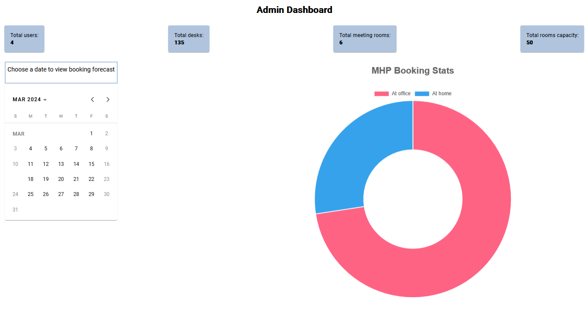

# The app

### Design Decisions

<li>The frontend uses Angular and the backend uses Flask. We decided to use python because the project also involved AI and time was pressing, so we needed seamless integration with the backend.
<li>The database is Postgres, because the data model fits the relational paradigma well.
<li>Authentication and authorization happens via jwt tokens. We chose this route because the app has different authorizations for different roles (admin, employee). 
<li>Communication with the backend happens over https.
<li>The architecture is a simple client-server.
  

## What we built

Upon connecting to the website the user should log in with the credentials provided by the one running the app as well as select their role.

After logging in they will be greeted with the map of the office.

Selecting the date of a booking in the top left corner and clicking on an available desk will enable them to book that seat to themselves. Clicking on a meeting room will enable them to add other participants for the given room. For both types of bookings an user can see the other bookings as well as pick a starting and ending time for his booking.

A user can also view and delete their bookings

# AI Development

## Feature engineering

Considering that the dataset was very simple, we decided to add and extract meaningful features, such as seat adjacency and weekdays.

### 15.03.2024 

We simply tried running the database through different classifiers, from Random Forest Classifier to XGBClassifier to MLPClassifier, provided by Scikit-Learn only obtaining accuracies around 50%. Then we tried using TensorFlow to create a neural network to predict initially obtaining better accuracy, but realising something in our approach was flawed.

### 16.03.2024 

We corrected our approach and ran it through the same classifiers obtaining better results of 56% accuracy.
   
We then started looking at the data more closely and realised that seat adjacency may be significant, and we investigated that finding out that they do not have as great a significance as we believed.
We also tried a probability-based model for estimating if a given desk will be occupied also considering the day of the week for which we’re estimating. It had 61% accuracy.
   
This was an insightful approach, because the dataset was very simple. Basically, if a model were to learn the dataset perfectly when using the weekday feature, it would be impossible for it to reach a higher accuracy than this.
   
Conference rooms were estimated with a neural network trained for each interval for which data was available having an accuracy of between 56-62%. Each has its own slightly different neural network as none was able to have high accuracy for all intervals.
   
We also trained a model for predicting office occupation, which could be useful for admins.
   

# Getting started

<h4>Backend</h4>

To start the app, you need to create the environment we are using
To begin with, in the backend folder, run the following commands
  
<code>>python -m venv venv</code>  
<code>>venv/Scripts/activate</code>  
<code>>pip install -r requirements.txt</code>  
<code>>flask db upgrade</code>   

Make sure you also have a .env file in the backend folder with the environment variables necessary for the app to start.  

  
Starting the backend after this is simple:

<code>>python app.py</code>

Upon successful completion one shall see something among the lines of:

<h4>Frontend</h4>

You need to install the node packages we are using. Go to the frontend folder and run  
<code>>npm install</code>

The app should start upon executing the following in the frontend folder:

<code>>npm start</code>

After some waiting the app should be running and the command line should display:

### Notes

<li> We pushed the ssl certificates to make testing easier. These are generated locally, so your browser might not want to accept them. To fix this, navigate to the backend url in a browser, and click continue. This should convince the browser that the url is safe when making requests via javascript.
<li> The app automatically adds rooms and users upon startup. The requirements said there was no signup functionality, so we added our own data for testing.
<li>The master branch contains the latest app version.

<li>Lastly, we want to thank the organisers for the event. Good job, guys. We mean it.
