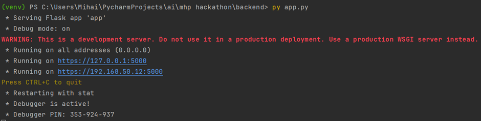
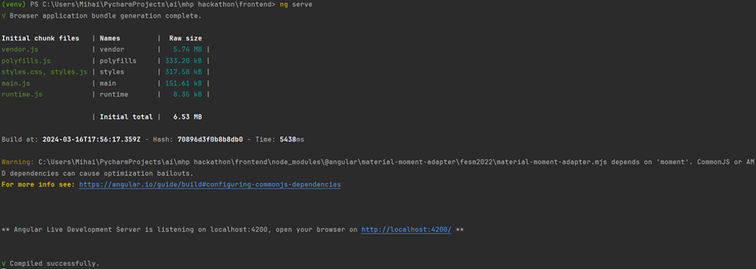
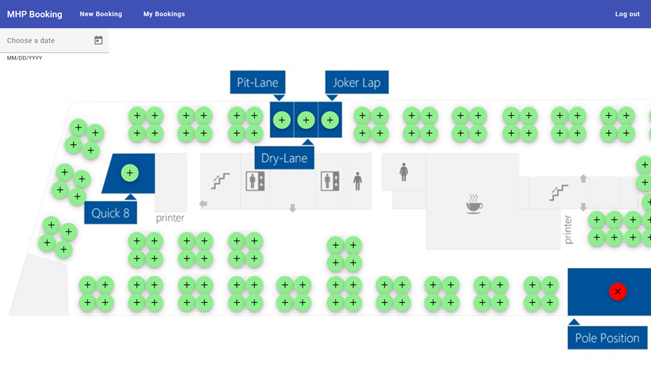
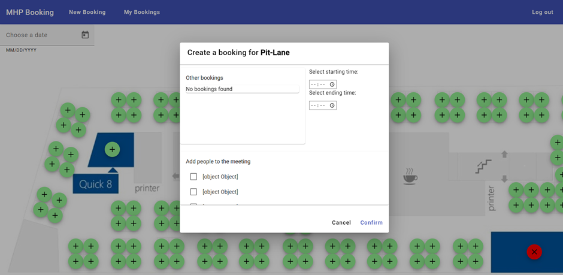

<h4>Backend</h4>

Starting the backend is quite simple: one would open a command line of their choice, navigate to the backend folder and execute:

<code>>python app.py</code>

Upon successful completion one shall see something among the lines of:

<h4>Backend</h4>

The app should start upon executing the following in the frontend folder:

<code>>ng serve</code>

After some waiting the app should be running and the command line should display:

If the app did not successfully start one could execute the following command in the frontend folder:

<code>>npm install</code>

<h4>The app itself</h4>

Upon connecting to the website the user should log in with the credentials provided by the one running the app as well as select their role.

After logging in they will be greeted with the map of the office.

Selecting the date of a booking in the top left corner and clicking on an available desk will enable them to book that seat to themselves. Clicking on a meeting room will enable them to add other participants for the given room. For both types of bookings an user can see the other bookings as well as pick a starting and ending time for his booking.

<h4>AI Development</h4>
15.03.2024 
We simply tried running the database through different classifiers, from Random Forest Classifier to XGBClassifier to MLPClassifier, provided by Scikit-Learn only obtaining accuracies around 50%. Then we tried using TensorFlow to create a neural network to predict initially obtaining better accuracy, but realising something in our approach was flawed.

16.03.2024 
We corrected our approach and ran it through the same classifiers obtaining better results of 56% at best and realised we could obtain the same accuracy, if not better if we just coded a guess based on the percentage of occupation of given seats.
We then started looking at the data more closely and realised that seat groups may be significant, and we investigated that finding out that they do not have as great a significance as we believed
In the end we settled for a probability-based model for estimating if a given desk will be occupied also considering the day of the week for which we’re estimating as this has proven to have consistent 61% accuracy.
Conference rooms were estimated with a neural network trained for each interval for which data was available having an accuracy of between 56-62%. Each has its own slightly different neural network as none was able to have high accuracy for all intervals.
